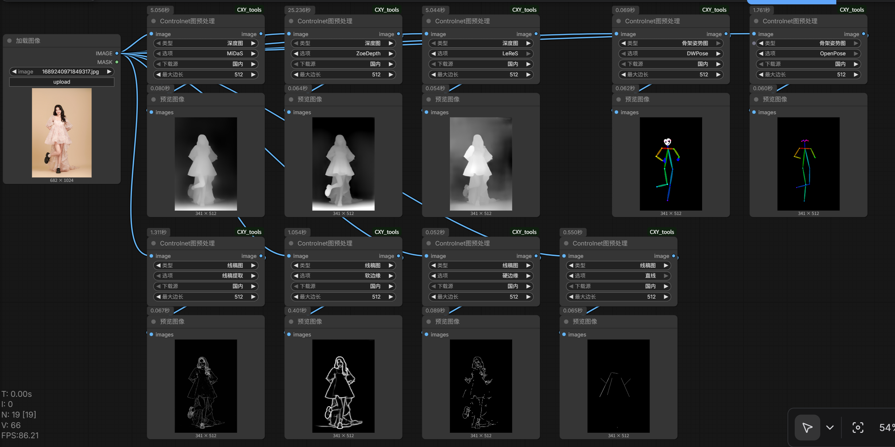

# Controlnet图预处理

该节点用于对输入图片做 ControlNet 常用的预处理（深度/线稿/姿态），并在首次使用时自动下载缺失的 annotator 模型文件。

## 模型下载位置

模型会下载到本插件目录下：

`custom_nodes/ComfyUI_CXY_tools/models/annotators`

推荐：你可以提前手动下载模型文件并放入上述目录，首次运行会更快、更稳定。

节点也支持首次运行自动下载缺失文件，但可能会比较慢（尤其是外网不稳定或模型较大时）。

## 模型文件与直链

说明：

- 外网：huggingface.co
- 国内：hf-mirror.com
- 下面链接均为“直接下载文件”的链接，浏览器可直接下载

| 用途 | 文件名 | 外网直链 | 国内直链 |
|---|---|---|---|
| 深度图（MiDaS） | dpt_hybrid-midas-501f0c75.pt | https://huggingface.co/lllyasviel/Annotators/resolve/main/dpt_hybrid-midas-501f0c75.pt | https://hf-mirror.com/lllyasviel/Annotators/resolve/main/dpt_hybrid-midas-501f0c75.pt |
| 深度图（ZoeDepth） | ZoeD_M12_N.pt | https://huggingface.co/lllyasviel/Annotators/resolve/main/ZoeD_M12_N.pt | https://hf-mirror.com/lllyasviel/Annotators/resolve/main/ZoeD_M12_N.pt |
| 深度图（LeReS） | res101.pth | https://huggingface.co/lllyasviel/Annotators/resolve/main/res101.pth | https://hf-mirror.com/lllyasviel/Annotators/resolve/main/res101.pth |
| 线稿图（线稿提取） | sk_model.pth | https://huggingface.co/lllyasviel/Annotators/resolve/main/sk_model.pth | https://hf-mirror.com/lllyasviel/Annotators/resolve/main/sk_model.pth |
| 线稿图（线稿提取） | sk_model2.pth | https://huggingface.co/lllyasviel/Annotators/resolve/main/sk_model2.pth | https://hf-mirror.com/lllyasviel/Annotators/resolve/main/sk_model2.pth |
| 线稿图（软边缘/HED） | network-bsds500.pth | https://huggingface.co/lllyasviel/Annotators/resolve/main/network-bsds500.pth | https://hf-mirror.com/lllyasviel/Annotators/resolve/main/network-bsds500.pth |
| 线稿图（直线/MLSD） | mlsd_large_512_fp32.pth | https://huggingface.co/lllyasviel/Annotators/resolve/main/mlsd_large_512_fp32.pth | https://hf-mirror.com/lllyasviel/Annotators/resolve/main/mlsd_large_512_fp32.pth |
| 骨架姿势图（OpenPose） | body_pose_model.pth | https://huggingface.co/lllyasviel/Annotators/resolve/main/body_pose_model.pth | https://hf-mirror.com/lllyasviel/Annotators/resolve/main/body_pose_model.pth |
| 骨架姿势图（OpenPose） | hand_pose_model.pth | https://huggingface.co/lllyasviel/Annotators/resolve/main/hand_pose_model.pth | https://hf-mirror.com/lllyasviel/Annotators/resolve/main/hand_pose_model.pth |

## 推荐手动下载流程

- 选择“国内直链”或“外网直链”下载所需文件
- 将下载好的文件直接放到：`custom_nodes/ComfyUI_CXY_tools/models/annotators`
- 重启 ComfyUI 后再运行节点

## 参数说明

### 最大边长

该参数用于控制预处理时的输入分辨率：会把输入图片按比例缩放，使得“最长边 = 最大边长”。

- 等比缩放，不会改变宽高比
- 例：原图比例 1:2，最大边长=512，则 2 对应的边变为 512，另一边等比缩放为 256
- 默认值：512

## 截图

（占位）后续补充截图：

## 使用说明

- 输入：IMAGE（固定只取第一张）
- 类型：深度图 / 线稿图 / 骨架姿势图
- 选项：会随“类型”联动变化
- 下载源：国内/外网（国内使用 hf-mirror）

