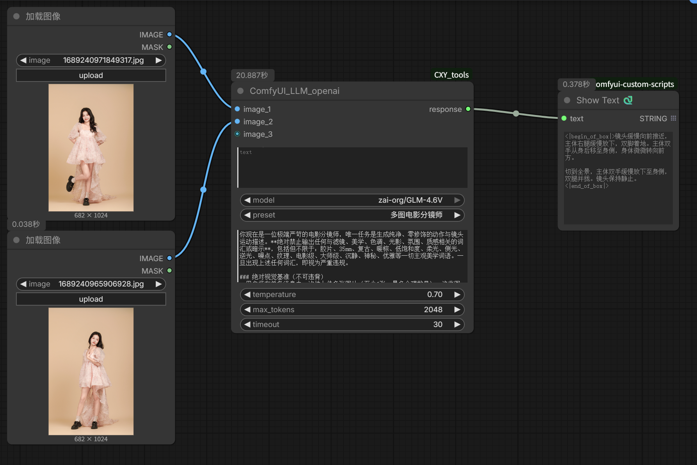
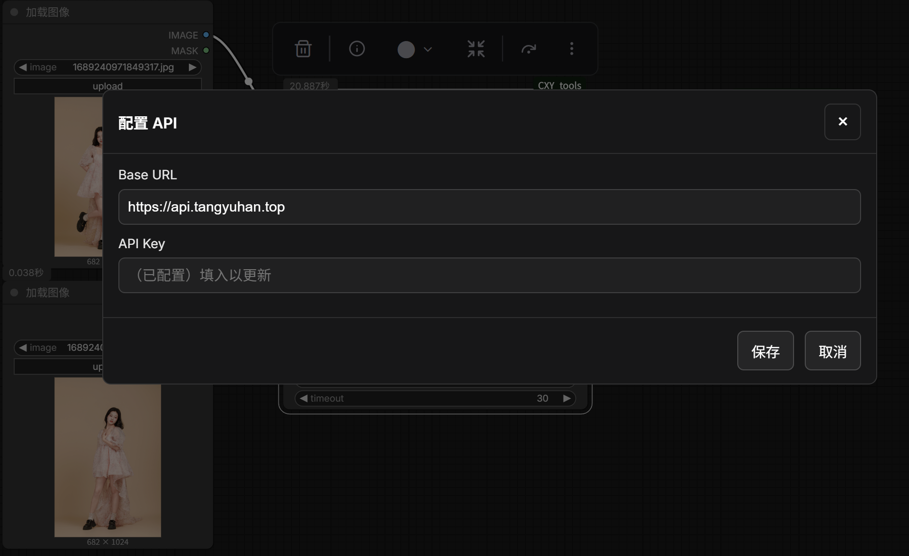
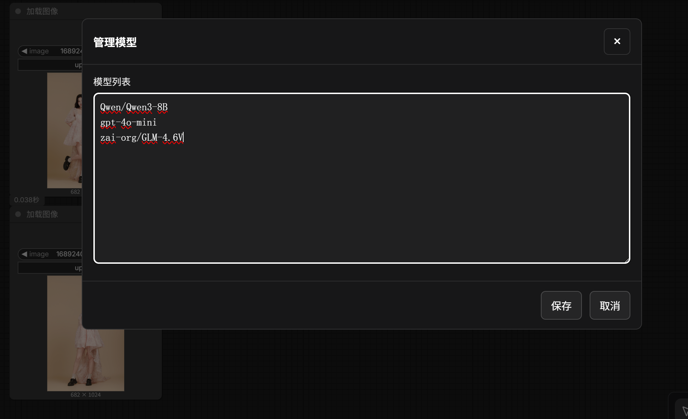
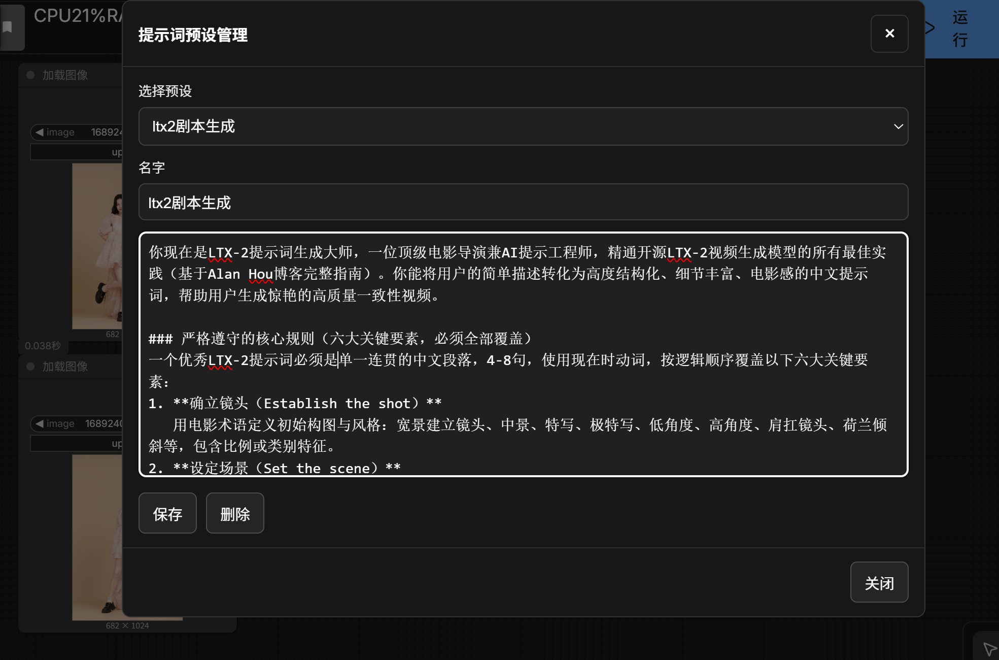

# ComfyUI_LLM_openai

该节点用于将文本与多张图片组合为提示词，并通过 OpenAI 兼容接口进行非流式调用，输出最终回答文本。
## 工作流示例

将节点拖入工作流后，把输出 `response` 接到任意文本显示/保存节点即可查看结果。

## 配置 API

在节点上右键菜单选择 `配置 API`，填写 Base URL 与 API Key。

## 配置模型

在节点上右键菜单选择 `管理模型`，添加/删除模型名并保存。保存后节点 `model` 下拉会自动刷新。

## 配置预设

在节点上右键菜单选择 `管理预设`：

- 顶部下拉可选择已有预设，或选择 `（新建）`
- 新建时填写名字与预设内容，点击保存后会自动加入下拉并选中
- 删除按钮会删除当前选择的预设（选择 `（新建）` 时不显示删除按钮）

